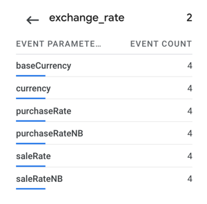
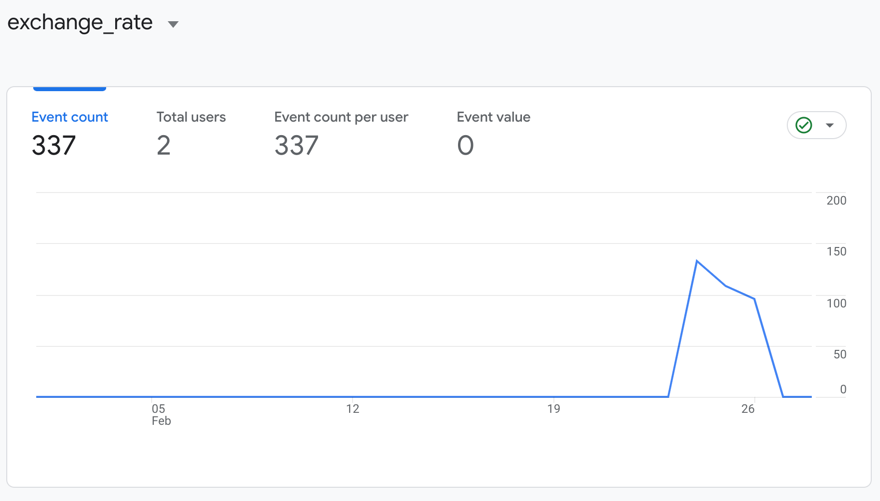
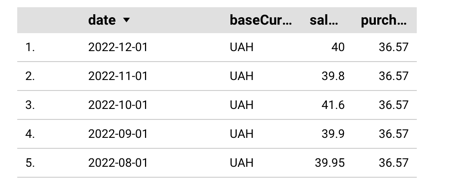

# Description

Sample application to send Google Analytics
using [measurement protocol](https://developers.google.com/analytics/devguides/collection/protocol/ga4).

Script works in a following way:

* query privat24 api first day of month in a period between 2015 and 2022;
* filter UAH-USD pairs;
* send to analytics;

# Result

Screenshot from `Reports > Realtime`:

~~Was not able to see events from `Admin > Events` tab, need to wait for 24h.~~

Screenshot from `Admin > Events`:

Screenshot from `Looker Studio`:

# Key points

* Use GA4 protocol as universal metrics are being deprecated;
* To generate client_id use gtag script;
* To debug correctness of event request, use `/debug` at the beginning of the uri;
* To validate event sending, use `Reports > Realtime` tab;
* client_id can be random. Maybe, I was a bit inattentive on this one, but I did not receive events in Realtime tab.
  Need to recheck.
* to be able to build dashboards you need to create `Custom dimensions` and `Custom metrics` before sending events.
    * dimension is an attribute of the data. It can also be seen as key or separate row. In our case it would
      be `baseCurrency`, `currency`, `date`.
    * metric is data to be aggregated. In our case: `purchaseRate` and `saleRate`.

# Useful resources:

* https://ga-dev-tools.google - to test events
* https://lookerstudio.google.com/ - to build dashboards over events
